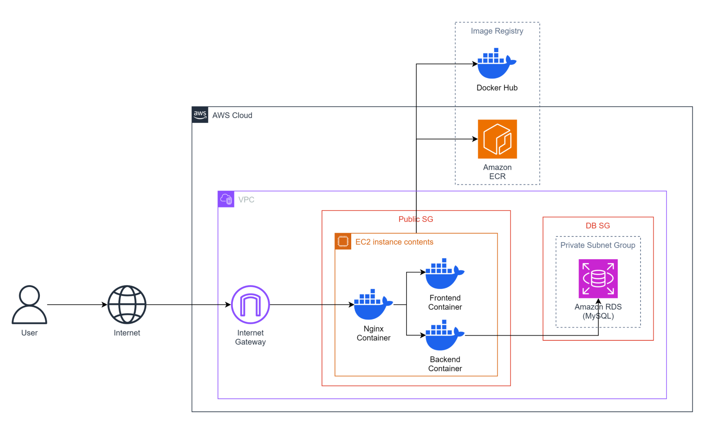

# WORKSHOP DEPLOYING DOCKERIZED APPS ON AWS

This workshop provides a comprehensive guide to the end-to-end process of containerizing and operating applications using Docker. You will gain hands-on experience managing the application lifecycle through core services: **Docker Hub**, **Nginx**, **Amazon ECR**, **Amazon RDS**, and **Amazon EC2**.

---

### Core Services
- **Docker Hub**: A public registry used to store and share Docker images.
- **Nginx**: Functions as a Reverse Proxy and Load Balancer to optimize traffic distribution and scalability.
- **Amazon ECR**: A secure, fully-managed private registry on AWS, deeply integrated for image management and deployment.
- **Amazon RDS**: A managed database service that automates operations and ensures data security.
- **Amazon EC2**: Virtual server infrastructure (Compute) used to run Docker containers.

---

### System Architecture
- **Traffic Ingress**: Client requests are sent over the Internet, passing through the Internet Gateway to enter the AWS VPC environment.
- **Reverse Proxy & Routing**: Nginx receives the traffic and acts as a Reverse Proxy, routing requests to the appropriate containers: Backend and Frontend containers.

- **App Logic & Data Processing**:
    - The Frontend (**React**) sends requests to the Backend (Node.js) for business logic processing.
    - The Backend (**Node.js**) executes CRUD queries with Amazon RDS.
    - After processing, data is sent back (Response) via the reverse flow: Backend → Nginx → Client.
- **CI/CD & Image Management**:
    - When the source code (React/Node.js) is updated, new Docker images are built and pushed to Docker Hub or Amazon ECR.
    - From these registries, the application is deployed or updated directly onto Amazon EC2 instances.

---

### Resources
| Resources | Link |
| :--- | :--- |
| **Workshop Link** | [ Deploying Dockerized Applications on AWS](https://levuxuananit.github.io/aws-workshop-deploy-app-on-docker-with-aws/1-introduce/) |
| **Source Code** | [GitHub Repo](https://github.com/levuxuananit/aws-table-cloud-pos) |

---