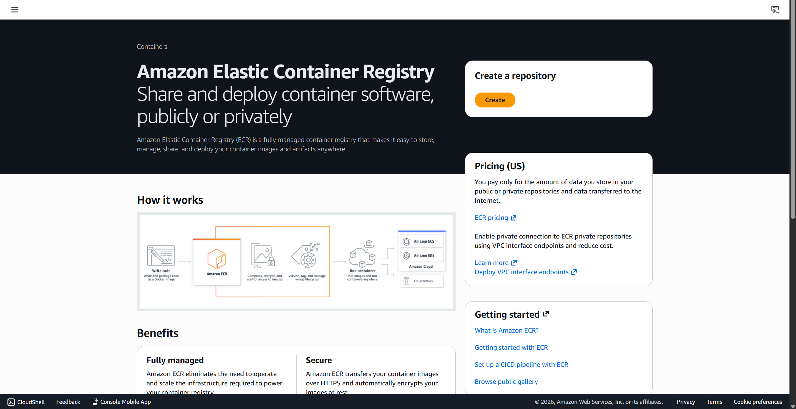
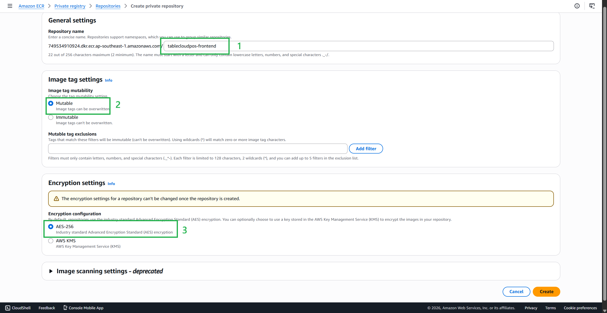
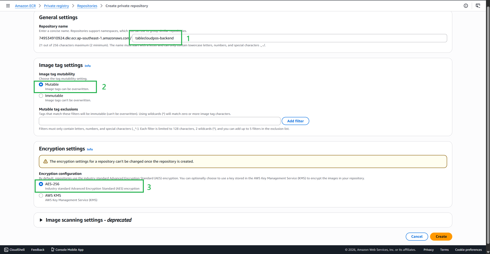
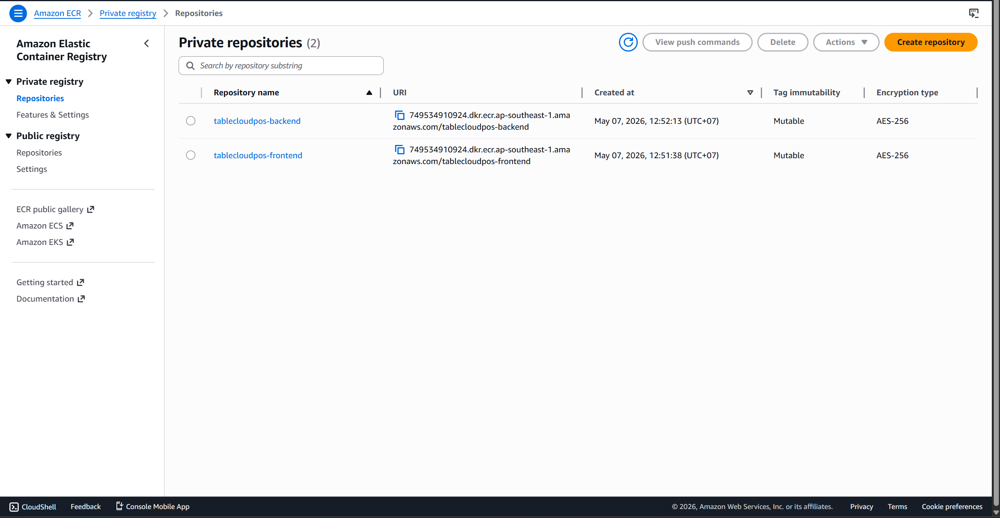
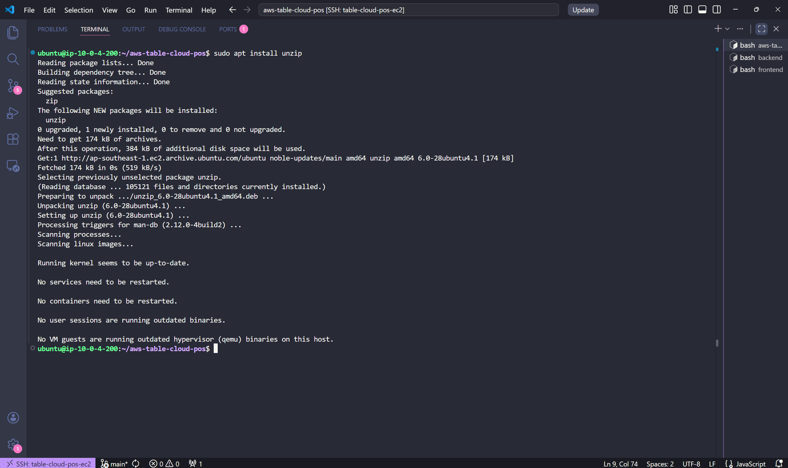
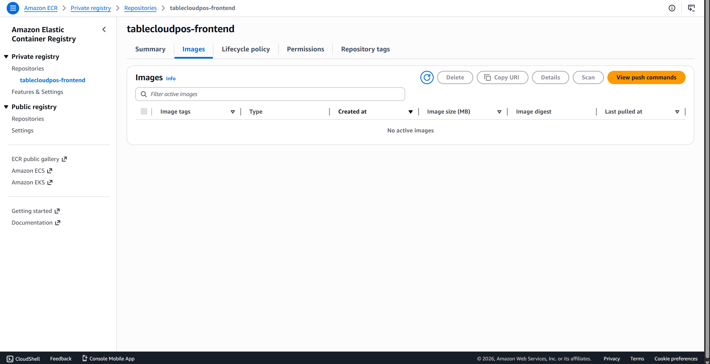
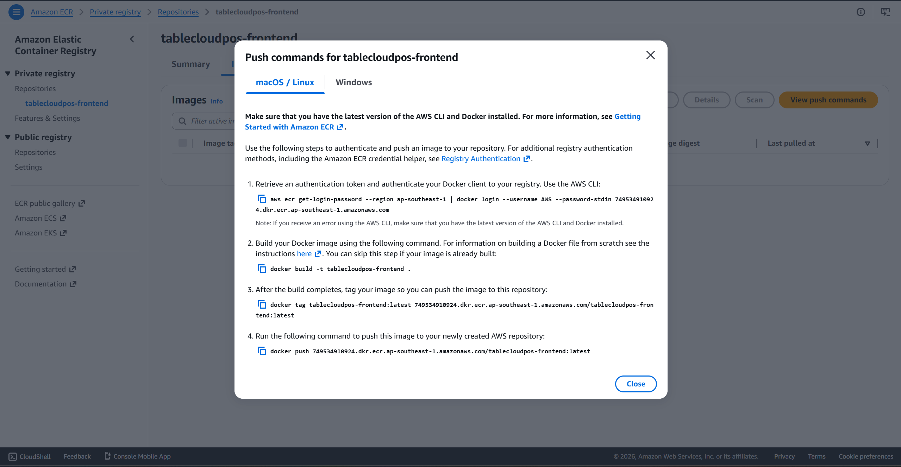

### Creating an ECR Repository to Store Docker Images
Search for **Amazon Elastic Container Registry**.

- Select **Create**.



We will create **2 different repositories** to contain the **Docker Images**:

- Repository name: `tablecloudpos-frontend` and `tablecloudpos-backtend`
- Image tag mutability: select **Mutable**.

- Encryption configuration: leave as default.





The result you get is a **repository** containing two different **Docker Images**.



{}
We need to create a separate repository for each application to manage Docker image versions more easily, especially for implementing [CI/CD](https://aws.amazon.com/vi/what-is/ci-cd-pipeline/) later.

{}

### Install AWS CLI
By default (October 15, 2024), AWS CLI is not installed by default in Ubuntu. First, we need to download the **unzip**: `sudo apt install unzip`


Then we will use the commands below to install AWS CLI.

```bash
curl "https://awscli.amazonaws.com/awscli-exe-linux-x86_64.zip" -o "awscliv2.zip"
unzip awscliv2.zip
sudo ./aws/install
```

### Push Docker Images to Repository
To push the Docker Image of the **frontend** to ECR (similarly for the **backend**). - First, go back to the **ECR Console**.

- Select `tablecloudpos-frontend` (If it's a backend: select `tablecloudpos-backend`).
- Press the **View push commands** button.


- A dialog box will then pop up, and we can see a series of commands.



Returning to the EC2 Instance, we need to use the Root User to log into ECR with Docker.

- In the AWS console of **Push commands for tablecloudpos-frontend**

- Select the first command to authenticate logging into the **Amazon Elastic Container Registry** (ECR) from your **Docker local** environment. Beforehand, make sure you have configured **AWS Configure**.

{}
Because when a user uses sudo to log into ECR with Docker, the credentials are stored in that user's HOME directory. But when performing a push or pull command, it will look for the credentials in the Root directory instead of the HOME directory that was saved during the previous login.

{}

In the previous sections, we created images for each application, so now we just need to tag them appropriately and push them to the corresponding **Registry**.

In the AWS console for **Push commands for tablecloudpos-frontend**:

- Select the third command to perform tagging, replacing the resource image names you created earlier.

{}
General format `<Account_ID>.dkr.ecr.<region>.amazonaws.com/<Repository_Name>:<Name_tag>`
{}

After creation, proceed to push the **Image** to **ECR**.

- In the AWS console for **Push commands for tablecloudpos-frontend**:

- Select the `push` command.

Proceed similarly with the **Image** of the **backend**. Remember to copy the login command. But log out first.

### Results
After the push is complete, we can see the images that have been pushed to each **repository**.

